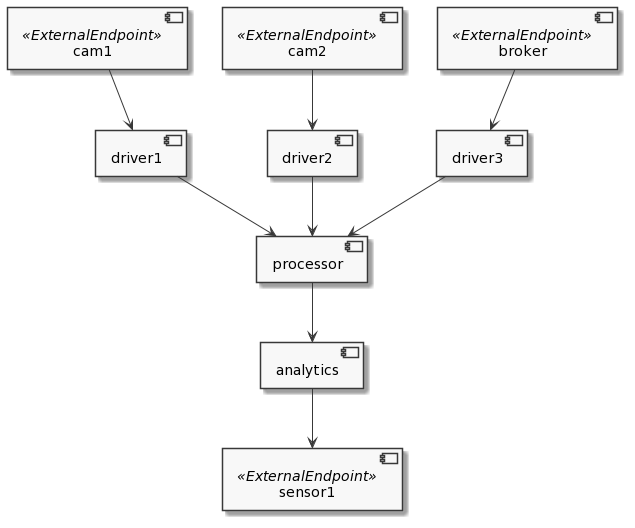

# FADepl Controller
FADepl controller extends k8s in order to handle geographically distributed clusters where
network infrastructure takes a relevant role. The FADepl controller is based on the k8s
[sample-controller](https://github.com/kubernetes/sample-controller) and is able to handle
the placement of FADepl resources (see below) on a distributed k8s cluster.


## Resources (CRD)

Apart from the usual resources defined in k8s, FADepl controller defines the following CustomResourceDefinition
1. **Region** as aggregation of computational power. Among other parameters, Regions are characterized by a location.
See [here](./examples/region.yaml) for an
example of Region.
1. **External Endpoint** intended as Sensors, Cameras, Things or more generally any external endpoint that can
work as source or sink of data. See [here](./examples/externalendpoint.yaml)
for an example of External Endpoint.
1. **Link** describing the connectivity between different Regions.
See  [here](./examples/link.yaml) for an example of Link.
1. **FADepl** that is an extended definition of k8s Deployment. Its aim is to model an
entire cloud-native application (not just a single microservice/deploment).
See  [here](./examples/fadepl.yaml) for an example of FADepl.

All these types have been defined in the `crd-client-go` repository.

## Placement algorithm

FADepl controller places FADepl resources on a distributed k8s cluster selecting the
"best" region for that FADepl. Note that FADepl controller stops its placement at region
level avoiding to go at nodes level: the reason of this is that, once selected the region, the
exact node, inside that region, where a given deployment will be placed, will be selected by
k8s itself.

Currently fadepl controller implements three placement algorithms
1. **Silly**: it assumes that the field `regionrequired` is defined for each microservice
and just places a microservice following the `regionrequired` field: no resource required
(cpu, ram, mips, network) are taken into account.
Moreover you can decide to put a given microservice in multiple
regions and to customize the number of replicas and image for each of them. Silly but powerful;
1. **DAG**: it is able to place applications that can be represented by a _Directed Acyclic Graph_.
We assume that the information/data flows South - North from the sensors to the cloud.
However, an actuation can be modeled considering a flow from a microservice to an instance
of sensor (external endpoint) different from the one that sends the data.
No need to specify `regionrequired` with this algorithm but if `regionrequired` is specified, it must be just one for each microservice. This algorithm considers the resources already allocated and computes the placement based on the available resources (both computational and network ones). Moreover the algorithm takes into consideration the maximum
resource available in a given region (i.e. the maximum amount of resource a given node can offer in a given region): the algorithm can select a region only if `maxResource > requestedResource`. The algorithm find the placement that minimized the usage of the resources.
Note that the placement of a parent microservice depends on the placement of its children and on its own requirements.
The relationship `child - parent` is determined by the data flow (the source is the child while
the destination is the parent).

The following figure shows a example of application graph that could be placed by the
_DAG_ algorithm.



In a nutshell:
* if no _regionrequired_ => DAG
* if one _regionrequired_ for each microservice => either DAG or Silly
* if many _regionrequired_ for each microservice => Silly

New algorithms can be implemented and added to fadepl controller loading them
in the `./fadepl/setup.go` file (check function `registerAlgorithms` for more details).
Such algorithms must be developed in golang and must adhere to the
following interface:

```sh
type PlacementAlgorithm interface {
	Init(name string, kubeclientset kubernetes.Interface, faDeplclientset clientset.Interface)
	CalculatePlacement(fadepl *fadeplv1alpha1.FADepl) (err error)
	CalculateUpdate(fadepl *fadeplv1alpha1.FADepl) (err error)
}
```
We are finalizing the integration in FogAtlas of a more generic algorithm, able to
manage also non-DAG applications, based on _Ant Colony Optimizazion_ (ACO).

**Note**: only the _Silly_ algorithm implementation is currently publicly available.

### How different models of CPU are handled

**Assumption:** what follows works in the assumption that each region is homogeneous
in terms of CPU model/architecture and that the algorithm used is DAG (with Silly algorithm it
doesn't work).

Since in fog environment we can have different models of CPU installed, the user has
the possibility to express the amount of CPU in terms of both MIPS or `k8s resource.Quantity`.
The second case is the standard one in k8s while the first one can be used in order to
take care of environment having different CPU: the user can request a given amount of MIPS
for her application and the algorithm computes the placement according to the MIPS available
for each region. Once placement is computed, then MIPS are converted in the corresponding
`k8s resource.Quantity` of the region where the microservice will be placed.

Note that if both MIPS and `k8s resource.Quantity` are specified, MIPS value takes the precedence.

### Handling GPU

The support for GPU in k8s is currently experimental and is based on the so-called *Device Plugin*.

Not all the GPU vendors offer an implementation of a device plugin and not for all types of GPUs.
For example NVIDIA offers a device plugin for X86 based GPUs but not for ARM based.
Moreover in case of heterogeneous GPU (i.e. different types of GPU on the same node), it is not possible
to distinguish among the resource requested just looking at the Deployment specification:
```
resources:
	  limits:
	    nvidia.com/gpu: 1
```
Even though device plugin offers a lot of functionality, namely checking the number of GPU,
their health, their occupancy and ensure isolation (only one container can use a given GPU),
for all the above mentioned reasons we think that the best way to proceed is to use
a simple `Node Selector - Node Label` combination instead of the device plugin one.
So we have to follow these steps:
* label the nodes according to their GPUs:
    ```
    accelerator: <gpu-type>
    ```
* once a FADepl is submitted with:
    ```
    nodeSelector:
      accelerator: <gpu-type>
    ```  
    then the FogAtlas scheduling algorithm (DAG) is executed only among
    those regions that have nodes labeled with that accelerator type.

### Caveats
1. In case of Silly algorithm, no check of resource availability is made: it means that, if a region required is
specified together with a `nodeSelector` (e.g. for requesting a node with a GPU)
and if the two specification aren't coherent, then the pod will remain in a Pending state forever.
1. In case of DAG algorithm, if `regionrequired` is specified together with
a `nodeSelector` (specifying a GPU), then the algorithm checks if the region has the requested GPU. If no,
then the placement fails.
1. In case of DAG algorithm, when a microservice requires the usage of a GPU,
then the other constraints (CPU, RAM) are checked only against regions that have at least
one GPU.
1. No algorithm checks the occupancy of the GPU resources and doesn't compute those resources
for optimizing the placement: what is checked is only if the resource is present (or not).
1. DAG and Silly algorithms can work without `dataflows` connecting microservices belonging
to the application.   
1. Multiple containers per Pod are allowed but in this case we have to give up to the
features of (i) MIPS specification and (ii) multiple regions required with an override
on the images and/or replicas for each single region (feasible only with the Silly algorithm).
If this is the case, the controller logs a warning and ignores the features.

## What you need to do in order to play with FADepl controller

### Prerequisites

**Note**: FogAtlas has been tested in the following environment:
* Ubuntu 18.04
* Kuberntes v1.20.x

1. Set up a k8s cluster (>= v1.20) with one master node and two workers. Ideally you
will have a cluster with 3 physical (or virtual) machines with Ubuntu 18.04 and
with these flavors (CPU-RAM-DISK):
   * master: 2-2-40
   * worker1: 2-2-40
   * worker2: 2-2-40
1. Write down a FADepl resource in order to deploy an application. You can find an example
[here](./examples/fadepl-silly.yaml). In the example file we put just two nginx images.
Change them as you like.

### Actions

1. Create a docker container image for the FADepl controller and push it on your registry
(set accordingly the `REGISTRY` variable in the Makefile):
   ```
	 make registry-login
	 make build
	 make push
	 ```
1. Customize the file `./k8s/fadepl-controller.yaml.template` according to your needs.
At least you need to replace the image with the url of your docker registry.
Once done, copy it to file `./k8s/fadepl-controller.yaml`.
1. Customize the file `./k8s/registry-credentials-template.yaml` adding the token for
accessing your docker registry (where you pushed the fogatlas images). Then copy it to file
`./k8s/registry-credentials.yaml`.
1. Use the Makefile to deploy FogAtlas:
   ```
   make deploy
   ```
1. See what happens. You should see something like this where `.reg.003-003` and
	 `.reg.002-002` are the identifiers of the regions where the deployments/pods have
	 been placed:
	 ```sh
	 kubectl get fadepls
	 ------------------------------------------------------------------------
	 NAME         AGE
	 simple-app   9s
	 ------------------------------------------------------------------------

	 kubectl get deployments
	 ------------------------------------------------------------------------
	 NAME                    READY   UP-TO-DATE   AVAILABLE   AGE
	 driver.reg.003-003      1/1     1            0           5s
	 processor.reg.002-002   1/1     1            0           5s
	 ------------------------------------------------------------------------

	 kubectl get pods
	 ------------------------------------------------------------------------
	 NAME                                    READY   STATUS    RESTARTS   AGE
	 driver.reg.003-003-6d6d858d87-wrfb6     1/1     Running   0          25s
	 processor.reg.002-002-bfc5c77bd-tbmrp   1/1     Running   0          25s
	  ------------------------------------------------------------------------
	  ```
1. Undeploy everything:
	 ```sh
	 make clean
   ```	 

## License

Copyright 2019 FBK CREATE-NET

Licensed under the Apache License, Version 2.0 (the “License”); you may not use this
file except in compliance with the License. You may obtain a copy of the License
[here](http://www.apache.org/licenses/LICENSE-2.0).

Unless required by applicable law or agreed to in writing, software distributed under
the License is distributed on an “AS IS” BASIS, WITHOUT WARRANTIES OR CONDITIONS OF ANY KIND,
either express or implied. See the License for the specific language governing permissions
and limitations under the License.


